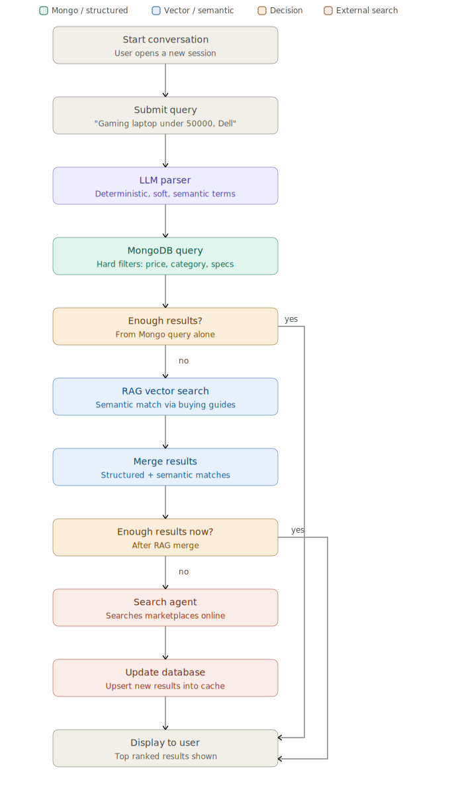
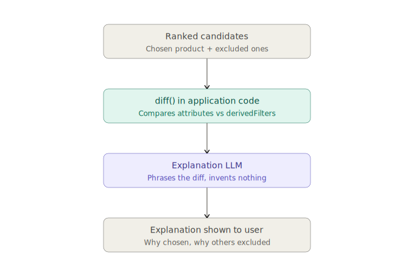

# AI Buying Assistant — MVP

A conversational product-recommendation system. A user describes what they want in natural language (e.g. *"gaming laptop under 50000, preferably Dell"*), and the system resolves that into a structured search across a cached product catalog, a semantic (RAG) layer for subjective terms, and a live web search fallback — then explains its recommendation with a grounded, non-hallucinated justification.

This document describes the MVP scope only. Production-grade upgrades (weighted ranking, write-through vector sync, parallel structured+semantic querying) are noted inline as deferred, not omitted by oversight.

---

## 1. Data Models & Schema

MongoDB is the primary store (see [§7](#7-why-mongodb) for justification). Two collections — `ProductEmbedding` and `BuyingGuide` — live in a separate vector database, cross-referenced by ID.

### `User`
| Field | Type | Notes |
|---|---|---|
| `_id` | ObjectId | PK |
| `name` | String | |
| `email` | String | unique index |
| `passwordHash` | String | |
| `createdAt` | Date | |

### `Conversation`
| Field | Type | Notes |
|---|---|---|
| `_id` | ObjectId | PK |
| `userId` | ObjectId | FK → `User._id`, indexed |
| `title` | String | |
| `createdAt` / `updatedAt` | Date | |

### `Message`
| Field | Type | Notes |
|---|---|---|
| `_id` | ObjectId | PK |
| `conversationId` | ObjectId | FK → `Conversation._id`, indexed |
| `role` | Enum: `user` \| `assistant` \| `system` | |
| `content` | String | raw text |
| `parsedIntent` | Embedded object | `{ category, hardFilters, softPreferences, semanticTerms }` — small, always read with the message, never queried independently, so it's embedded rather than a separate collection |
| `timestamp` | Date | |

### `ProductCategory`
| Field | Type | Notes |
|---|---|---|
| `_id` | ObjectId | PK |
| `name` | String | e.g. "Laptop" |
| `parentCategory` | ObjectId (nullable) | self-referencing, for taxonomy trees |
| `description` | String | |

### `ProductCache`
| Field | Type | Notes |
|---|---|---|
| `_id` | ObjectId | PK |
| `category` | ObjectId | FK → `ProductCategory._id`, indexed |
| `title`, `brand`, `model` | String | |
| `price`, `currency` | Number, String | indexed on `price` |
| `specifications` | Embedded object | `{ CPU, GPU, RAM, Storage, ... }` — schema-flexible, shape varies per category |
| `rating`, `reviewCount` | Number | |
| `marketplace` | String | Amazon / Flipkart / etc. |
| `buyUrl` | String | |
| `lastUpdated` | Date | indexed — drives cache-staleness checks |

### `ProductEmbedding` *(vector DB)*
| Field | Type | Notes |
|---|---|---|
| `embeddingId` | UUID | PK in vector DB |
| `productId` | ObjectId | FK → `ProductCache._id` — the join key between the two databases |
| `embeddingVector` | Float[] | |
| `metadata` | Object | denormalized `category`, `brand` for native vector-DB filtering |

### `BuyingGuide` *(vector DB — MVP: replaced by a hardcoded lookup table, see §4)*
| Field | Type | Notes |
|---|---|---|
| `guideId` | UUID | PK |
| `title`, `content` | String | |
| `category` | ObjectId | FK → `ProductCategory._id` |
| `embedding` | Float[] | |

**Deferred to Phase 2 (not needed for MVP):** `UserPreference`, `SearchHistory` — both are personalization/analytics layers that don't block a working v1 recommendation flow.

---

## 2. Minimal Routes (MVP)

| Method | Path | Auth | Purpose |
|---|---|---|---|
| POST | `/auth/register` | Public | |
| POST | `/auth/login` | Public | |
| POST | `/auth/logout` | Authenticated | |
| GET | `/auth/profile` | Authenticated | |
| POST | `/conversations` | Authenticated | Start new conversation |
| GET | `/conversations` | Authenticated | List user's conversations |
| GET | `/conversations/:id` | Authenticated | Fetch one conversation |
| POST | `/chat/message` | Authenticated | Main entrypoint — triggers the full retrieval pipeline (§3) |
| GET | `/chat/history/:conversationId` | Authenticated | Paginated message history |
| POST | `/search` | Authenticated | Runs the retrieval + merge pipeline directly (used internally by `/chat/message`, also callable standalone) |
| POST | `/compare` | Authenticated | Feature comparison across product IDs |
| GET | `/products/:id` | Authenticated | Single product detail |
| GET | `/products/category/:category` | Authenticated | Browse by category |
| GET | `/products/:id/buy-links` | Authenticated | Marketplace links |
| POST | `/internal/web-search` | Internal only | Web Search Agent — not exposed to frontend |

Everything else from the production route list (`/internal/rag`, `/internal/extract`, `/internal/rank` as separate services, `/preferences`) is deferred — MVP collapses those into in-process logic rather than standalone services.

---

## 3. Response Generation — From Query to Answer



```
User opens a conversation
        │
User submits a query
  e.g. "gaming laptop under 50000, preferably Dell"
        │
        ▼
LLM parser splits the query into three buckets:
  • hard filters       (price <= 50000)              → deterministic
  • soft preferences   (brand: Dell, boost not filter) → deterministic but non-excluding
  • semantic terms     ("gaming specs")                → needs domain interpretation
        │
        ▼
MongoDB structured query using hard filters + derived spec filters
        │
   enough results? ── yes ──────────────────────┐
        │ no                                    │
        ▼                                       │
RAG / semantic lookup resolves "gaming specs"    │
  → derives concrete thresholds (GPU/RAM/CPU)    │
  → vector search over ProductEmbedding          │
        │                                        │
        ▼                                        │
Merge structured + semantic candidates           │
        │                                        │
   enough results now? ── yes ───────────────────┤
        │ no                                    │
        ▼                                        │
Web Search Agent queries live marketplaces       │
  → extracts + normalizes into ProductCache schema│
  → filters again locally against derived filters │
  → upserts new products into ProductCache        │
        │                                        │
        ▼                                        │
        └───────────────► Ranked top 5 ◄──────────┘
                              │
                              ▼
                diff() compares chosen vs. excluded
                against the same derived filters
                              │
                              ▼
                Explanation LLM phrases the diff
                (constrained to only the facts in the
                 diff object — cannot invent specs)
                              │
                              ▼
                Response returned to user:
                ranked products + grounded explanation
```

**Why `diff()` matters here:** the ranking decision is made deterministically in code before any LLM call. The Explanation LLM never re-decides which product is best — it only narrates a decision that already happened, using a pre-computed attribute comparison (`diff()`) as its only allowed input. This is what keeps the explanation grounded rather than hallucinated (see §5 for how this is verified).



---

## 4. Merging Strategy — Unified Search Across Three Sources

MVP deliberately simplifies this to a **sequential fallback**, not a parallel three-way merge:

1. **MongoDB structured query runs first** (cheapest, deterministic). If it returns ≥5 results, stop here.
2. **Only if Mongo is thin**, run semantic/vector search as a fallback, then merge:
   ```
   merged = structuredResults
   for each semanticResult:
       if semanticResult.id not already in merged:
           append it
   ```
   No weighted scoring in MVP — a product appearing in both sets isn't double-counted or boosted, it's just deduplicated by `productId`.
3. **Only if the merged set is still thin**, the Web Search Agent runs. Its extracted results are written into `ProductCache` synchronously (this doubles as the MVP's cache-warming mechanism — there's no separate ingestion pipeline yet), then folded into the same merge step.
4. **Final sort:** boolean brand-preference match first, then price ascending — not a multi-factor weighted score.

**"gaming specs" resolution in MVP** is a hardcoded lookup table (~10 common semantic terms → concrete spec thresholds), not a live RAG query over a `BuyingGuide` vector collection. This is a deliberate scope cut: the LLM's own domain knowledge already covers common categories; RAG's real value is in the long tail of ambiguous/unseen terms, which is a Phase 2 investment.

```
parsedIntent: {
  category: "Laptop",
  hardFilters: { price: { lte: 50000 } },
  softPreferences: { brand: "Dell", weight: 0.15 },
  semanticTerms: ["gaming specs"],
  needsClarification: false
}
```

```
derivedFilters: {
  GPU: { in: ["RTX4050", "RTX3050", "RTX4060"] },
  RAM: { gte: 16 },
  CPU: { in: ["Ryzen 7", "i5-13420H", "i7-13620H"] }
}
```

| MVP shortcut | Deferred production upgrade |
|---|---|
| Sequential fallback (Mongo → vector → web) | Parallel structured + semantic query, merged with overlap scoring |
| Hardcoded semantic lookup table | Live RAG over `BuyingGuide` vector collection |
| Boolean brand-match + price sort | Weighted multi-factor ranking (semantic/spec/rating/price/brand) |
| Synchronous web-write on cache miss | Async ingestion pipeline + write-through vector sync |

---

## 5. Evaluation Pipeline — Judging the Explanation Quality

The core question this pipeline answers: **is the explanation actually grounded in the diff, or did the LLM add something it wasn't given?** This matters more than fluency — a fluent but hallucinated explanation is a worse failure than an awkward but accurate one.

### Pipeline stages

1. **Capture** — every explanation call logs the triple: `(query, diffObject, generatedExplanation)`. This is the raw material every downstream check runs against.

2. **Automated groundedness check** (runs on every response, cheap, MVP-appropriate):
   - Extract the attribute names/values mentioned in the generated explanation (simple keyword/entity match against known spec fields: GPU, RAM, price, brand, rating).
   - Check each mentioned attribute exists in the corresponding `diffObject` for that product.
   - Any attribute mentioned in prose but **absent from the diff** is flagged as a potential hallucination.
   - Output: a groundedness score per response (`attributes_grounded / attributes_mentioned`).

3. **LLM-as-judge check** (sampled, not every request — cost control for MVP):
   - A separate judge prompt is given the `diffObject` and the generated explanation, and asked: *"Does this explanation state anything not supported by the given diff? Does it address the top reason for each exclusion?"*
   - Judge outputs a pass/fail plus a short flagged-claim list.
   - This catches subtler issues the keyword check misses (e.g. an implied comparison not literally naming a field).

4. **Consistency check against the ranking logic** — verifies the explanation's stated reasoning actually matches what determined the ranking (from §4's sort rule: brand-match then price). If the explanation claims a reason that wasn't part of the actual sort/filter logic, that's a logic-explanation mismatch, not just a factual one — a distinct and more serious failure mode.

5. **Human review sampling** — MVP samples a small percentage of responses (e.g. 2–5%) for manual review, focused on cases the automated checks flagged as borderline. This is the fallback for judgment calls the automated checks can't resolve confidently.

6. **Feedback loop** — responses failing groundedness or consistency checks are logged with their `diffObject` and used to refine the Explanation LLM's system prompt (tightening the "use only these facts" constraint) rather than silently ignored.

### MVP vs. production scope

| MVP | Deferred |
|---|---|
| Keyword-level groundedness check on every response | Full semantic entailment check (explanation implies nothing beyond the diff) |
| LLM-judge on a sample | LLM-judge on every response, with a dedicated eval model |
| Manual review of flagged cases only | Structured human-eval rotation with inter-rater agreement tracking |
| Metrics logged, not yet dashboarded | Groundedness rate / hallucination rate as tracked production SLOs |

---

## 6. Functional & Non-Functional Requirements

### Functional
- User can register, log in, and start a conversation.
- User can send a natural-language product query and receive ranked recommendations.
- System explains why the top product was chosen and why close alternatives were excluded.
- User can compare specific products side by side.
- User can retrieve buying links for a recommended product.
- Conversation history persists and is retrievable per user.

### Non-Functional
- **Latency:** `/search` should resolve from cache alone (Mongo-only path) in well under 1s; the web-search fallback path is allowed to take longer (multi-second) since it's the least-frequent path, but should not block indefinitely — needs a timeout.
- **Availability:** the chat/search path should degrade gracefully — if the vector DB or web search agent is unavailable, structured Mongo results should still be returned rather than the whole request failing.
- **Consistency:** the vector DB is treated as a derived index, not source of truth — `ProductCache` in Mongo is authoritative; embeddings can be rebuilt from it, not the reverse.
- **Security:** authenticated routes require a valid session/token; internal routes (`/internal/web-search`) are not reachable from the frontend.
- **Explainability:** every generated explanation must be traceable back to a `diffObject` — this is treated as a correctness requirement, not a nice-to-have (see §5).
- **Data quality dependency:** explanation grounding is only as reliable as the underlying `specifications` tagging — this is a named, accepted limitation for MVP, not a solved problem.

---

## 7. Why MongoDB

Product specifications vary significantly and unpredictably across categories — a laptop has `GPU`/`CPU`/`RAM`, a monitor has `RefreshRate`/`PanelType`, a refrigerator has `EnergyRating`/`Capacity`. A relational schema would require either a sparse fixed table (mostly-null columns) or a separate normalized attribute table per category (join-heavy, slower to iterate on for an MVP).

MongoDB's document model lets `ProductCache.specifications` be an embedded, schema-flexible object — each product only carries the fields relevant to its category, with no schema migration needed to add a new category or a new spec field. This directly matches the system's actual variability, rather than fighting it.

**Trade-off accepted knowingly:** a flexible nested schema is harder to index efficiently for range queries across mixed categories (e.g. `RAM >= 16` across products where `RAM` might be typed inconsistently). The production-grade fix — a normalized `filterableSpecs` sub-object with fixed, indexed fields computed at ingestion — is deferred; MVP accepts less efficient filtering in exchange for schema simplicity while the catalog is small.

---

## 8. How RAG Improves Retrieval Quality Here

Structured filtering can only match what's explicitly tagged in `specifications` — it has no way to interpret a subjective phrase like *"gaming specs"* or *"value for money"* on its own. Two distinct problems RAG addresses:

1. **Resolving ambiguous/subjective query terms.** "Gaming specs" isn't a field in the schema — it's a judgment that depends on domain knowledge (which GPU tiers count as "gaming-capable," what RAM threshold matters). RAG retrieves this knowledge from curated buying guides and benchmarks rather than the LLM inventing thresholds from general training knowledge, which reduces the risk of confidently wrong filter derivation.

2. **Catching semantically-relevant products that structured tagging misses.** A product's `GPU` field might be stored as `"RTX 4050 Laptop GPU"` instead of the exact string `"RTX4050"` your filter expects — an exact-match Mongo query misses it, but a vector similarity search over `ProductEmbedding` can still surface it because the embedding captures semantic closeness, not exact field equality. This is why production merges both paths rather than relying on structured filtering alone: each catches real matches the other misses.

**In MVP specifically**, only the second mechanism's simplified fallback is active (vector search runs only when structured filtering is thin — see §4); the first mechanism (live RAG over `BuyingGuide`) is replaced by a hardcoded lookup table for the common-case terms, with true RAG retrieval deferred to Phase 2 for handling the long tail of terms the lookup table doesn't cover.

### Chat Link
```
https://claude.ai/share/de57c33d-2ccc-4358-a3b3-f11df1ec0e5b
```
